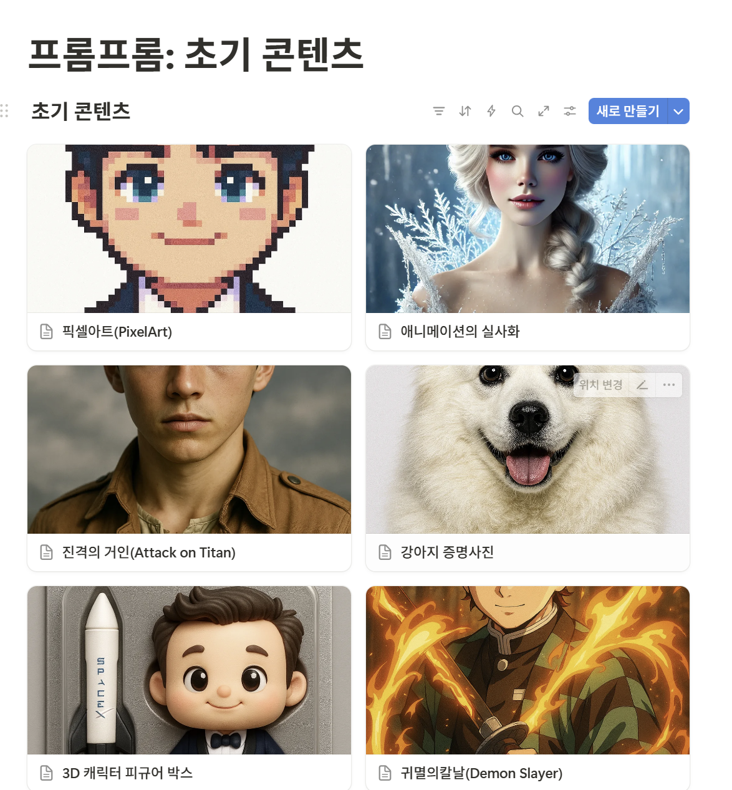

# 회고 및 배운점/느낀점
팀이 공동의 목표를 정한 이후, ‘수상 = 많은 사용자 확보’라고 생각했는데 그렇지 않았습니다. 주변 분들께 재미있고 흥미 있게 해보시라고 자연스럽게 권할 수 있는 서비스가 좋은 평가를 받을 것이라고 생각했지만, 명확한 페인포인트를 채워줄 수 있는 완성도 있는 기획이 더 좋은 평가를 받는 것 같습니다. 즉, 사용자를 넓게 잡을수록 공모전 수상과는 멀어진다는 느낌을 받았습니다.

처음부터 빠르게 팀원들을 설득하면서 두 번이나 기획했는데, 컨설턴트님과 실습 프로님께는 모두 좋은 평가를 받지 못해 갈아엎었습니다. 믿어주신 팀원들께 미안하기도 하고 자존감도 조금 상했고, 제가 생각하는 이상향이 공모전과는 잘 어울리지 않았던 것 같습니다.

서비스를 개발하면서 애자일하게 주변 사용자 반응을 보며 발전시켜 나가는 편을 좋아하지만, 명확한 기능과 일정 등 딱 정해진 것을 좋아하는 팀원들도 있고, 6명이 함께 일하기 위해서는 더 체계적인 생각으로 바뀌었습니다. 한편으로는 전 회사에서 혼자 업무를 수행하고 개발했던 버릇이 아직 조금 남아 있는 것 같다는 생각도 들었습니다.

그럼에도 정말 잘한 것은 팀원들을 주도적으로 찾아 잘 구성했다는 점입니다. 좋은 팀원들과 서로 소통하기 편한 분위기를 만들기 위해 노력했는데, 그 덕분에 처음에는 조금 헤맸지만 이후 큰 갈등 없이 모두가 만족할 수 있는 방향으로 잘 잡아 나가고 있는 것 같아 다행입니다. 이번 프로젝트도 열심히 하면 좋은 프로젝트로 남을 수 있을 것 같다는 생각이 들었습니다.

# 1주간의 기록

시간이 날때마다 회의를 진행했습니다. 기획이 빨리 정해지면 빠르게 목표가 정해질 수 있을 것 이라고 생각했고 정말 많은 아이디어가 나왔고, 제일 괜찮았던 기획을 컨설턴트님께 빠르게 피드백을 받는 것이 좋을 것 같아 빠르게 요청을 드렸습니다.
[(회의록링크)](https://platinum-cabin-2be.notion.site/22acd0d242e18078aa10ecb2780d77d0?v=22acd0d242e180eb8d91000c6055a18f&source=copy_link)
# 1차 기획/컨설팅

AI 부트캠프가 진행되는 동안 짬을 내가며 회의를 진행했고, 처음에는 트렌드에 맞춘 AI 이미지 컨버팅/생성을 도와주는 서비스를 기획했지만, 좋은 평가는 받지 못했다.
또한, 사용자를 받는 것, 기술적으로 하고 싶은 것, 수상 등 원하는 모든걸 공통프로젝트에서 가져가는 것 욕심이라는 조언을 받았다.

# 2차 기획/컨설팅

그래서 팀이 '수상'을 목표로 정하고, 각자 기획을 새로 디벨롭했습니다. 최소한의 기획안의 구성을 갖추기 위해 노력했습니다.

# 끝장 토론 이후 해루질로 확정
이재현 프로님의 조언에 따라 2가지 항목으로 최종적으로 추렸고, 한쪽이 설득이 될 떄 까지 끝장토론을 진행했다. 결과적으로는 해루질로 확정이 났었다.
[끝장토론 기록](https://platinum-cabin-2be.notion.site/vs-233cd0d242e18021a5c3e524d825a499?source=copy_link)

# 아키텍처 설계
를 위한 페르소나, 기능/비기능 명세서 회의를 진행했습니다.
박찬국 컨설턴트님이 강의해주신 내용을 정리해서 활용했습니다!
[(문서 정리 링크)](https://platinum-cabin-2be.notion.site/A405-233cd0d242e180daa504e5f1737d903f?source=copy_link)

## 페르소나

- 관광객
    
    
    | 필드 | 설명 |
    | --- | --- |
    | 이름/별칭 & 사진 | **박시민** |
    | 한줄 요약(Tagline) | “해루질을 유튜브에서 보고, 체험해보고 싶은 여행객” |
    | 목표(Goal) | 안전하게, 즐겁게 해루질을 하고 싶음 |
    | 주요 태스크(JTBD) | “어디서 캐도 되는지”, “안전한지”, “어디에 뭐가 잘 나오는지” 확인 |
    | Pain Points | 위험함
    - 파도, 바람, 해파리, 뻘 발빠짐, 밀물(갯벌 빠지면 자리에 박혀서 못 도망감) |
    | 트리거 & 동기 | 해루질을 하고싶을 때, 
    - 물때를 모를 때, 
    - 뭐 잡아도 되는지 모를 때, 
    - 여기서 해도 되는지 궁금할 때 |
    | 사용 맥락 | 제주도 해안/핸드폰/whenever |
    | 기술숙련도 & 데이터 문해력 | 앱 설치, GPS 허용 |
    | 신뢰요인 | 출처(수산자원관리법 등, 조례) |
    | 핵심 기능 니즈(우선순위) | 앱을 통해서 어디서 뭘 ‘안전’하게 잡을 수 있는지  |
    | 성공지표
    (이 페르소나가 “성공”이라 느끼는 경우/때) | - 만조시간 경고에 해루질을 멈추고 나왔을 때
    - 뭘 잡고싶은지에 따라 지역을 추천받을 때
    - 특정 지역에서 뭘 잡을 수 있고 뭘 잡으면 안되는지 확인할 때
    - 현재 지역이 해루질이 가능한지 확인할 때 |
    | 대표 인용문 | “해루질 하고싶은데, 어디서 할 수 있는지, 뭐가 잘 잡히는지 뭘 잡아야 하는지도 모르겠어요…” |
- 어업인
    
    
    | 필드 | 설명 |
    | --- | --- |
    | 이름/별칭 & 사진 | **전광례** |
    | 한줄 요약(Tagline) | 40년 경력 해녀 |
    | 목표(Goal) | 생계보존 → 내가 해녀질 하는 곳에 쓸고가서 잡을게 없음 |
    | 주요 태스크(JTBD) | 해루질을 통한 생계 활동 |
    | Pain Points |  내가 해녀질 하는 곳에 관광객들이 쓸고가서 잡을게 없음 |
    | 트리거 & 동기 |  |
    | 사용 맥락 |  |
    | 기술숙련도 & 데이터 문해력 |  |
    | 신뢰요인 |  |
    | 핵심 기능 니즈(우선순위) | 앱 기능으로 생계가 위협받지 않는 환경 보존 |
    | 성공지표 | 더 이상 관광객들이 무분별한 채집을 하지 않고 생계를 보존 받을 수 있는 상황/환경 |
    | 대표 인용문 | “코로나 이후 해루질이 유행하는 바람에, 수확량이 너무 줄었어요!”
    ”너죽고 나죽자!!!” - 실제 사례 |
- 지자체
    
    
    | 필드 | 내용 |
    | --- | --- |
    | 이름/별칭 & 사진 | 제주 해양 지자체 |
    | 한줄 요약(Tagline) | 불법 해루질 없이 건전한 문화를 만들고 싶음 |
    | 목표(Goal) | 지역 어업 종사자들과 해루질 관광객 사이의 분쟁을 원만하게 해결. + 건전한 해루질 문화 전파 |
    | 주요 태스크(JTBD) | 정보를 잘 몰라서 불법으로 하는 사람들에게는 교육이나 여러 가이드를 제공하고 싶음 |
    | Pain Points | 정보 홍보가 어려움
    법을 정하기 어려움(상위 법과 부딪힘)
    관광객과 어촌계와의 갈등 조율 |
    | 트리거 & 동기 | - 여름철 해루질 인파 급증
    - 불법 채집자 단속 요청 증가
    - 어촌계 요청 및 이민 생계 보호 필요 |
    | 사용 맥락 | 해루질 금지 구역(금지체장) 또는 가능 구역(유어장) |
    | 기술숙련도 & 데이터 문해력 | - |
    | 신뢰요인 | 수산자원관리법 시행령 |
    | 핵심 기능 니즈(우선순위) | 허용 및 금지 어장 안내, 금어기/체장 정보 제공
    관광객 대상 홍보용 해루질 안전 가이드 제공 |
    | 성공지표 | 어민들과 해루질 관광객 사이의 갈등(신고 접수 등) 축소
    올바른 해루질 문화 정착 |
    | 대표 인용문 | 싸우지 마세요.. |

## 기능요구사항

- **박시민(관광객) 입장에서**
    - 안전
        - 만조, 간조 (사망사고 발생)
        - 파고 (사망사고 발생)
        - 날씨 (바람, 비→ 기상청 api)
        - 시간 (일몰 30분 전까지)
        - 물골 (간조 때는 잘 보여도, 물이 약간이라도 차서 바닥이 잘 안 보이면 물살이 빠르거나 깊이가 깊어 미끄러져 빠져서 사고 나는 경우 다수)
        - 해파리 주의보
    - 내가 법을 잘 지키고 있나?
        - 잡으면 안되는 거 있나(수획량 포함)
        - 여기서 잡아도 되나?
    - 여기 잘 잡히나? (뭐가 잘 잡히나)
    - 어떤 장비가 필요하지?
        - 법적으로도 사용 가능한 장비가 지정되어 있음
    - 내가 잡은 게 뭐지?
        - 생물도감
    - 잡은 거 먹을 수 있나?
        - 기생충, 독…
    - 잡은 거로 해먹을 수 있는 게 뭐지?
    - 내가 잡은 거 큰 편인가?
    - 잡은 거 신선도 유지 어떻게 하나
    - 회 떠주는 데 없나?
    - 갈등이 발생하면 어떻게 하지?
        - 겨…경찰서? 어...어촌계?
        - 내가 맞나 해녀가 맞나
    - 일우의 뻘 체험 썰
        - 마지막에 씻는 게 불편했다.
        - 근처 화장실, 샤워실 있는지 알려주는거
        - 주차, 전기차 충전소
    - 신고서비스
- **전광례(해녀) 입장에서**
    - 우리 구역 이야기해주는 것
        - 여기 저희 구역이라 해루질 하시면 다쳐요
    - 다른데 가서 하라고 하고 싶은데 사람들이 다른 데를 모름
- **정부 입장에서**
    - 해루질 위험(분쟁)구역: 여기선 맨날 싸운다
        - 법적으론 문제없으나, 야생의 해녀를 만나면 장담 못함
    - 해루질 하지 말라고 하면 홍보가 안됨
    - 해루질 하라고 하면 해녀가 화냄
    - 지역경제 활성화
        - 해루질 근처에 갈만한 곳, 먹을만한 곳 (캐치테이블 2차 추천 느낌)

[정리](https://www.notion.so/5bd933cf275f4e788ab2c7acb3f516ac?pvs=21)

---

# 그 외 개인적으로 노력한 부분
- DB inc, 롯데이노베이트 서류 작성하고 취업 컨설턴트님께 피드백을 받았습니다.
- [코딩테스트 인증 스터디를 시작했습니다.](https://cotton-wood-c20.notion.site/1-22973fc720b280ad970efc1650e9f8a7) 재활 치료가 필요할 것 같습니다
- AWS SSA 자격증 취득을 위해서 널널한 개발자님 강의를 들으면서 CS공부와 네트워크를 공부했습니다.